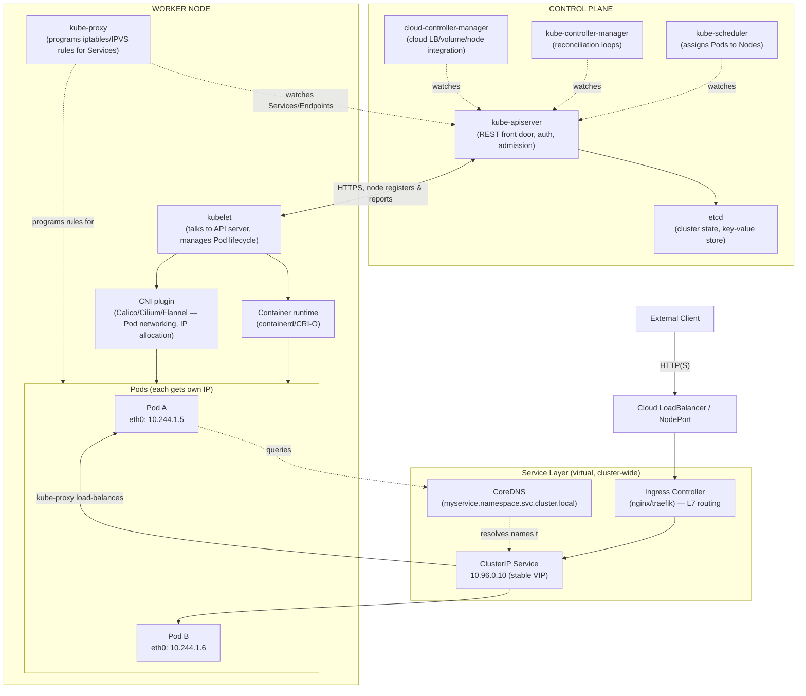

# Kubernetes: Beginner → Intermediate Master Guide

---

## 1. Architecture Overview (Networking-Focused)



### How traffic actually flows (read this twice)
1. **External → Cluster**: Client hits a cloud LoadBalancer or NodePort → forwarded to an **Ingress Controller** Pod (this is just a Pod running nginx/traefik, not a special K8s object doing the routing itself — the Ingress *resource* is just config it reads).
2. **Ingress → Service**: Ingress Controller reads `Ingress` rules (host/path) and forwards to a **ClusterIP Service**'s virtual IP.
3. **Service → Pod**: The Service has no listening process. `kube-proxy` on every node watches the API server for Service/Endpoints changes and programs **iptables or IPVS rules** that DNAT the Service VIP to one of the healthy backing Pod IPs (random or round-robin).
4. **Pod → Pod networking**: Every Pod gets a real, routable IP from the **CNI plugin's** IP pool (e.g., `10.244.0.0/16`). The CNI sets up virtual ethernet pairs + routes/overlay (VXLAN) or BGP so any Pod can reach any Pod on any node directly, no NAT — this is the "flat network" model K8s mandates.
5. **Name resolution**: Pods resolve `service-name.namespace.svc.cluster.local` via **CoreDNS**, itself a Service — this is how apps avoid hardcoding IPs.
6. **Node ↔ Control Plane**: Every node's `kubelet` maintains a persistent connection to `kube-apiserver` to report node/Pod status and receive Pod specs. `kube-apiserver` is the *only* component that talks to `etcd` — nothing else touches the datastore directly.

### The Big 4 Networking Rules (CNCF model — memorize these)
- Every Pod gets its own IP; no port-mapping needed inside the cluster.
- Pods can reach all other Pods' IPs across all nodes without NAT.
- A Node can reach all Pods on that node without NAT.
- Containers *within* a Pod share one network namespace (localhost between them) via the `pause` container.

### Service Types (networking-relevant)
| Type | Scope | Use case |
|---|---|---|
| ClusterIP (default) | Internal only | Default east-west communication |
| NodePort | `<NodeIP>:30000-32767` | Quick external access, dev/test |
| LoadBalancer | Cloud LB provisioned | Production external access |
| ExternalName | DNS CNAME, no proxying | Pointing to external services (e.g., an RDS endpoint) |
| Headless (`clusterIP: None`) | Direct Pod DNS records, no VIP | StatefulSets, client-side LB, service discovery |

---

## 2. Core Object Model (quick mental map)
- **Pod** → smallest deployable unit (1+ containers, shared network/storage).
- **ReplicaSet** → keeps N pod replicas alive (you rarely touch this directly).
- **Deployment** → manages ReplicaSets, gives you rolling updates/rollback.
- **StatefulSet** → like Deployment but stable network identity + storage per pod (databases, Kafka).
- **DaemonSet** → one pod per node (log/metric agents, CNI plugins themselves).
- **Job/CronJob** → run-to-completion or scheduled tasks.
- **ConfigMap/Secret** → externalized config/credentials, mounted as env vars or volumes.
- **PV/PVC/StorageClass** → decouples storage provisioning from Pod spec.
- **Namespace** → logical partition for multi-tenancy/RBAC scoping.

---

## 3. Troubleshooting Playbook

### General diagnostic sequence (use this every time)
```
kubectl get pods -o wide          # status, node, IP at a glance
kubectl describe pod <pod>        # events section is gold — READ IT FIRST
kubectl logs <pod> [-c container] [--previous]
kubectl get events --sort-by=.lastTimestamp -A
```

### Pod Status Issues
| Symptom | Likely Cause | How to Confirm | Fix |
|---|---|---|---|
| `Pending` | No node fits (resources/taints/affinity), no PVC bound | `kubectl describe pod` → Events show `FailedScheduling` | Check `kubectl describe node`, resource requests, `kubectl get pv,pvc` |
| `ImagePullBackOff` / `ErrImagePull` | Wrong image tag, private repo w/o `imagePullSecrets`, registry unreachable | `describe pod` Events | Fix image name/tag, add pull secret, check registry network policy |
| `CrashLoopBackOff` | App crashes on start — bad config, missing env, failing health check, OOM at startup | `kubectl logs <pod> --previous` (crucial — current container is gone) | Fix app config; check `initialDelaySeconds` on probes |
| `OOMKilled` (check via `describe pod` → Last State) | Container exceeded memory limit | `kubectl describe pod` shows `Reason: OOMKilled`, exit code 137 | Raise `resources.limits.memory` or fix memory leak |
| `Error` / non-zero exit | App-level failure | `kubectl logs` | Application-specific |
| Pod `Running` but not `Ready` | Readiness probe failing | `describe pod` → probe failure events | Check probe path/port, app startup time |
| `CreateContainerConfigError` | Missing ConfigMap/Secret key referenced in env | `describe pod` Events | Verify ConfigMap/Secret exists and key matches |
| `Init:CrashLoopBackOff` | Init container failing | `kubectl logs <pod> -c <init-container>` | Fix init container logic/dependency wait |

### Node Issues
| Symptom | Check | Fix |
|---|---|---|
| Node `NotReady` | `kubectl describe node <node>` → conditions (kubelet stopped, network unavailable, disk pressure) | Restart kubelet, check disk/memory pressure, check CNI pod on that node |
| `DiskPressure`/`MemoryPressure` True | `kubectl describe node` conditions | Free resources, evict pods, check `df -h`/`free -m` on node |
| Pods not scheduling on a node | Taints | `kubectl describe node` → Taints; check Pod tolerations |

### Networking-Specific Troubleshooting (your focus area)
| Symptom | Diagnostic Steps | Common Root Cause |
|---|---|---|
| Service unreachable from within cluster | 1) `kubectl get endpoints <svc>` — empty means no matching Pod labels<br>2) Check `selector` on Service matches Pod `labels` exactly<br>3) `kubectl exec` into a debug pod → `curl <svc-name>.<ns>.svc.cluster.local` | Label/selector mismatch (#1 cause), or Pod not Ready (Ready pods only are in Endpoints) |
| DNS resolution failing | `kubectl exec -it <pod> -- nslookup kubernetes.default`<br>`kubectl get pods -n kube-system -l k8s-app=kube-dns` | CoreDNS pods down/crashlooping, or `/etc/resolv.conf` misconfigured in pod, NetworkPolicy blocking port 53 |
| Cross-node Pod-to-Pod fails, same-node works | Check CNI pod logs on both nodes: `kubectl logs -n kube-system <cni-pod>` | CNI overlay/BGP misconfig, MTU mismatch, firewall blocking VXLAN port (UDP 4789) or BGP (179) |
| External LB not getting traffic to Pods | `kubectl get svc` (EXTERNAL-IP pending?), `kubectl describe svc` | Cloud controller manager issue, or `externalTrafficPolicy: Local` routing to a node with no local pod |
| Ingress 404/502 | `kubectl describe ingress`, check Ingress Controller logs, verify `backend service:port` | Path/host mismatch, wrong Service port, Service has no Ready endpoints |
| Intermittent connection resets | `kubectl get svc <svc> -o yaml` check `sessionAffinity`, check kube-proxy mode (iptables vs IPVS) | Known iptables-mode issue with long-lived connections + scaling events |
| NetworkPolicy blocking traffic unexpectedly | `kubectl get networkpolicy -A`, `kubectl describe networkpolicy <name>` | Default-deny policy applied without an explicit allow rule for the flow |
| Pod can't reach internet/external API | Check egress NetworkPolicy, check node's NAT/masquerade rules, check DNS for external names | Missing egress rule, or CNI not masquerading pod IP for external traffic |
| Two services with same port conflict on NodePort | `kubectl get svc -A -o wide` | NodePort range exhaustion or manual duplicate assignment |

### Quick network debug pod (keep this handy)
```bash
kubectl run netdebug --rm -it --image=nicolaka/netshoot -- /bin/bash
# then inside: curl, dig, nslookup, tcpdump, nc, mtr all available
```

### Storage Issues
| Symptom | Check | Fix |
|---|---|---|
| PVC stuck `Pending` | `kubectl describe pvc` | No matching PV/StorageClass, no default StorageClass set, provisioner not running |
| Pod stuck at `ContainerCreating` w/ volume mount error | `kubectl describe pod` events | PV already bound elsewhere (RWO conflict), node affinity mismatch on PV |

---

## 4. Kubectl Master Command List (by type)

### Cluster & Context
```bash
kubectl cluster-info
kubectl config get-contexts
kubectl config use-context <ctx>
kubectl config set-context --current --namespace=<ns>
kubectl version --short
kubectl api-resources
kubectl api-versions
kubectl explain <resource>[.field]        # inline docs, e.g. kubectl explain pod.spec.containers
```

### Get / List (inspection)
```bash
kubectl get pods [-o wide|-o yaml|-o json]
kubectl get pods -A                       # all namespaces
kubectl get pods -w                       # watch live
kubectl get pods -l app=myapp             # label selector
kubectl get pods --field-selector=status.phase=Running
kubectl get all
kubectl get events --sort-by=.lastTimestamp
kubectl get nodes -o wide
kubectl get svc,ep                        # services + endpoints together
kubectl get deploy,rs,pods                # ownership chain
kubectl top pod / kubectl top node        # requires metrics-server
```

### Describe (deep single-object inspection — your #1 debug tool)
```bash
kubectl describe pod <name>
kubectl describe node <name>
kubectl describe svc <name>
kubectl describe deployment <name>
kubectl describe ingress <name>
kubectl describe networkpolicy <name>
kubectl describe pvc <name>
```

### Logs & Exec
```bash
kubectl logs <pod> [-c container]
kubectl logs <pod> --previous             # crashed container's last logs
kubectl logs -f <pod>                     # follow/tail
kubectl logs -l app=myapp --all-containers=true --prefix
kubectl exec -it <pod> -- /bin/sh
kubectl exec <pod> -c <container> -- env
kubectl cp <pod>:/path/in/container ./local/path
kubectl attach <pod> -it
```

### Create / Apply / Edit
```bash
kubectl apply -f file.yaml
kubectl apply -f ./manifests/            # whole directory
kubectl create -f file.yaml
kubectl create deployment nginx --image=nginx
kubectl create configmap cfg --from-literal=key=value
kubectl create secret generic sec --from-literal=user=admin
kubectl edit deployment <name>
kubectl patch deployment <name> -p '{"spec":{"replicas":5}}'
kubectl set image deployment/<name> <container>=<image>:<tag>
kubectl label pod <name> tier=backend
kubectl annotate pod <name> note="test"
```

### Scaling & Rollouts
```bash
kubectl scale deployment <name> --replicas=5
kubectl autoscale deployment <name> --min=2 --max=10 --cpu-percent=70
kubectl rollout status deployment/<name>
kubectl rollout history deployment/<name>
kubectl rollout undo deployment/<name>
kubectl rollout undo deployment/<name> --to-revision=2
kubectl rollout restart deployment/<name>
kubectl rollout pause deployment/<name>
kubectl rollout resume deployment/<name>
```

### Delete
```bash
kubectl delete pod <name>
kubectl delete pod <name> --grace-period=0 --force   # stuck terminating
kubectl delete -f file.yaml
kubectl delete deployment,svc -l app=myapp
```

### Networking-specific
```bash
kubectl get svc,ep,ingress
kubectl port-forward pod/<name> 8080:80
kubectl port-forward svc/<name> 8080:80
kubectl get networkpolicy -A
kubectl run netdebug --rm -it --image=nicolaka/netshoot -- bash
kubectl get endpoints <svc>               # empty = selector mismatch or no Ready pods
```

### Context/Debugging Utilities
```bash
kubectl debug node/<node> -it --image=busybox     # debug a node without SSH
kubectl debug <pod> -it --image=busybox --target=<container>  # attach debug container to running pod
kubectl auth can-i create pods --as=<user>
kubectl auth can-i '*' '*' --as=system:serviceaccount:<ns>:<sa>
kubectl get pod <name> -o jsonpath='{.status.podIP}'
kubectl get pod <name> -o jsonpath='{.spec.containers[*].image}'
```

### RBAC
```bash
kubectl get roles,rolebindings -n <ns>
kubectl get clusterroles,clusterrolebindings
kubectl create rolebinding <name> --clusterrole=view --user=<user> -n <ns>
```

### Dry-run / YAML generation (great for fast manifest creation)
```bash
kubectl create deployment nginx --image=nginx --dry-run=client -o yaml > deploy.yaml
kubectl run testpod --image=busybox --dry-run=client -o yaml -- sleep 3600
```

---

## 5. Suggested Study Path
1. **Week 1** — Pods, Deployments, Services, ConfigMaps/Secrets. Get comfortable with `get`/`describe`/`logs`.
2. **Week 2** — Networking deep dive: kube-proxy modes, CNI, DNS, NetworkPolicy, Ingress. Break things on purpose (wrong selector, wrong port) and fix via the playbook above.
3. **Week 3** — StatefulSets, storage (PV/PVC/StorageClass), DaemonSets, Jobs/CronJobs.
4. **Week 4** — RBAC, resource requests/limits + HPA, node troubleshooting, `kubectl debug`, and a mock outage drill using the troubleshooting table end-to-end.
